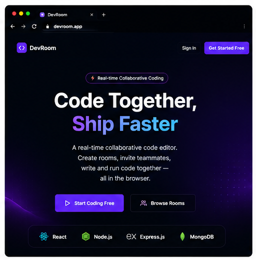
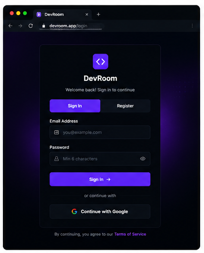
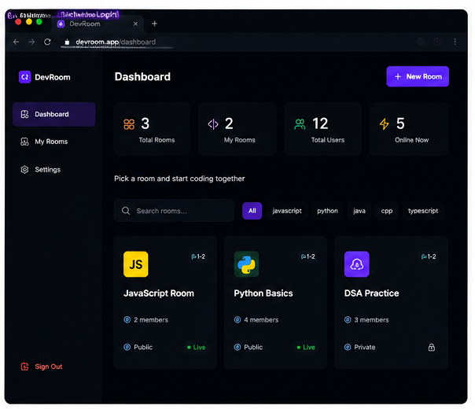
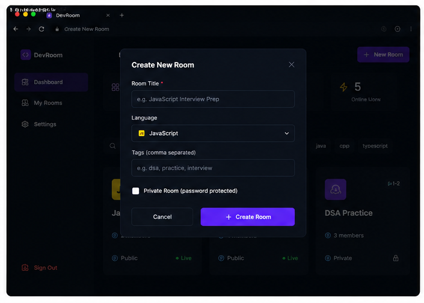
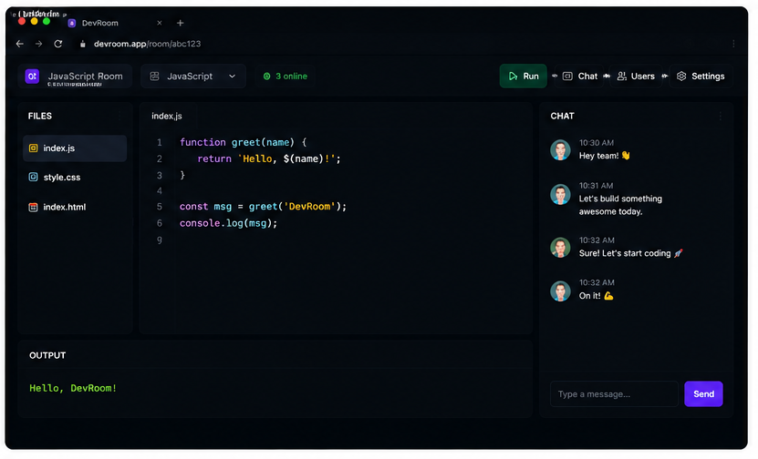

# 🚀 DevRoom — Real-Time Collaborative Code Editor

DevRoom is a full-stack real-time collaborative code editor that allows multiple users to create or join coding rooms, write code together, chat, and execute code in real time — all inside the browser.

Built with modern web technologies including React, Node.js, Socket.IO, MongoDB, and deployed on production cloud platforms.

---

## 🌐 Live Demo

**Frontend (Production):**
https://dev-room-drab.vercel.app

**Backend API Health Check:**
https://devroom-backend-hnbu.onrender.com/api/health

---

## 📸 Screenshots

### 1️⃣ Landing Page
Modern landing page showcasing DevRoom’s core features including real-time collaborative coding, room creation, and multi-language code execution.

<p align="center">
  
</p>

---

### 2️⃣ Login / Authentication Page
Secure authentication using Email/Password login and Google OAuth with JWT-based authorization.

<p align="center">
  
</p>

---

### 3️⃣ Dashboard
Centralized dashboard to browse, filter, and manage public/private coding rooms.

<p align="center">
  
</p>

---

### 4️⃣ Create New Room
Create public or private coding rooms with language selection and privacy settings.

<p align="center">
  
</p>

---

### 5️⃣ Live Collaborative Editor
Real-time collaborative code editor with live synchronization, code execution, and integrated chat.

<p align="center">
  
</p>


---

## ✨ Features

* 🔐 Authentication using Email/Password and Google OAuth
* 👥 Create and join collaborative coding rooms
* ⚡ Real-time code synchronization using WebSockets
* 💬 Live room messaging/chat
* 🧠 Multi-language code editor support
* 🎨 Theme support (VS Dark and more)
* 🏷️ Language-based room filtering
* 👤 Room ownership and participant management
* 🔄 Persistent room sessions using MongoDB
* ☁️ Production deployment with Vercel + Render + MongoDB Atlas

---

## 🛠 Tech Stack

### Frontend

* React 18
* React Router
* Context API
* Socket.IO Client
* Axios
* Monaco Editor
* Framer Motion
* React Hot Toast

### Backend

* Node.js
* Express.js
* Socket.IO
* JWT Authentication
* bcrypt.js
* Google OAuth Library
* REST APIs

### Database

* MongoDB Atlas
* Mongoose ODM

### Deployment

* Frontend → Vercel
* Backend → Render
* Database → MongoDB Atlas

---

## 🏗 System Architecture

```text
Frontend (React + Vercel)
        ↓
 REST APIs + WebSocket
        ↓
Backend (Node + Express + Socket.IO + Render)
        ↓
MongoDB Atlas
```

---

## 📂 Project Structure

```bash
DevRoom/
│
├── frontend/
│   ├── public/
│   ├── src/
│   │   ├── components/
│   │   ├── context/
│   │   ├── pages/
│   │   ├── utils/
│   │   └── App.js
│   └── package.json
│
├── backend/
│   ├── config/
│   ├── models/
│   ├── routes/
│   ├── socket/
│   ├── server.js
│   └── package.json
│
└── README.md
```

---

## 🔌 API Endpoints

### Auth

```http
POST /api/auth/register
POST /api/auth/login
POST /api/auth/google
```

### Rooms

```http
GET /api/rooms
POST /api/rooms
```

### Code Execution

```http
POST /api/execute
```

### Health

```http
GET /api/health
```

---

## ⚙️ Environment Variables

### Backend (`backend/.env`)

```env
PORT=5000
NODE_ENV=development
MONGO_URI=your_mongodb_connection_string
JWT_SECRET=your_secret_key
GOOGLE_CLIENT_ID=your_google_client_id
CLIENT_URL=http://localhost:3000
```

### Frontend (`frontend/.env`)

```env
REACT_APP_API_URL=http://localhost:5000/api
REACT_APP_GOOGLE_CLIENT_ID=your_google_client_id
```

---

## 🚀 Local Setup

### Clone Repository

```bash
git clone https://github.com/ay001-web/DevRoom.git
cd DevRoom
```

### Backend Setup

```bash
cd backend
npm install
npm run dev
```

### Frontend Setup

```bash
cd frontend
npm install
npm start
```

---

## 🧠 Challenges Solved During Development

* Real-time socket synchronization
* Production CORS configuration
* Google OAuth deployment issues
* MongoDB Atlas authentication setup
* Frontend–backend environment management
* Multi-service deployment pipeline

---

## 📈 Future Improvements

* Voice chat inside rooms
* Video collaboration
* Cursor presence indicators
* Code execution sandbox improvements
* Invite-by-link system
* AI coding assistant integration

---

## 👨‍💻 Author

**Ayush Yadav**
B.Tech CSE (Data Science) — SRM Institute of Science and Technology

GitHub: https://github.com/ay001-web

---

## 📄 License

This project is licensed under the MIT License.

---

⭐ If you like this project, consider giving it a star on GitHub.
